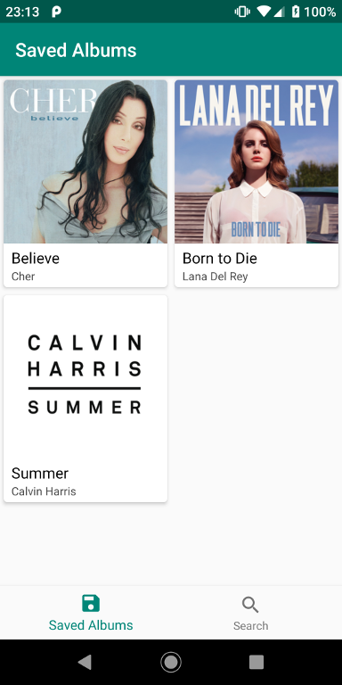
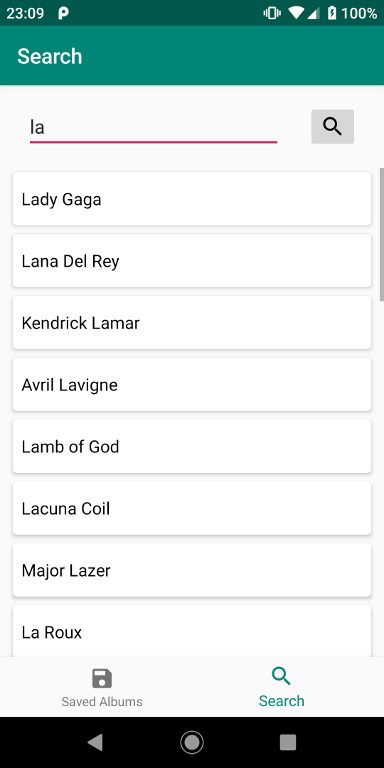
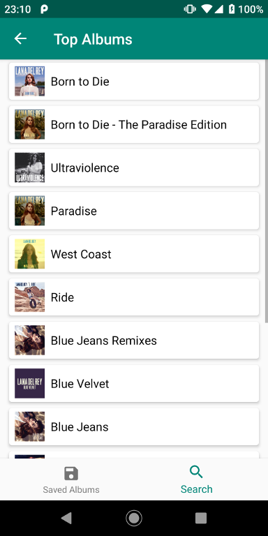
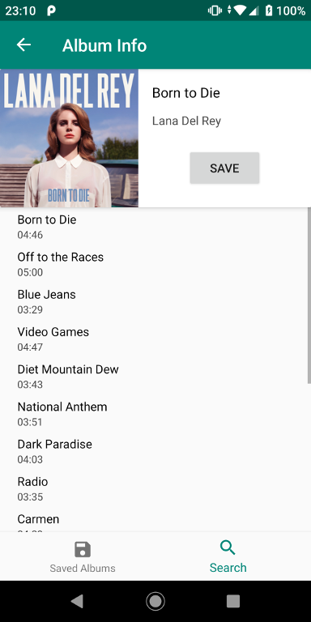

# LastFM Albums

Demo application for managing music albums based on the [LastFM API](https://www.last.fm/api/).

## Built With

* Clean Architecture
* Kotlin, Coroutines
* Dagger2
* Navigation Component (Jetpack)
* ViewModel (Jetpack)
* Retrofit
* Glide

## Prerequisites

To build and run this project get the [LastFM API key](https://www.last.fm/api/authentication) to get instructions how to do it.

Define your Client ID in ``app/build.gradle``
```
def lastFmApiKey = '"<API_KEY>"'
```


## Screenshots







